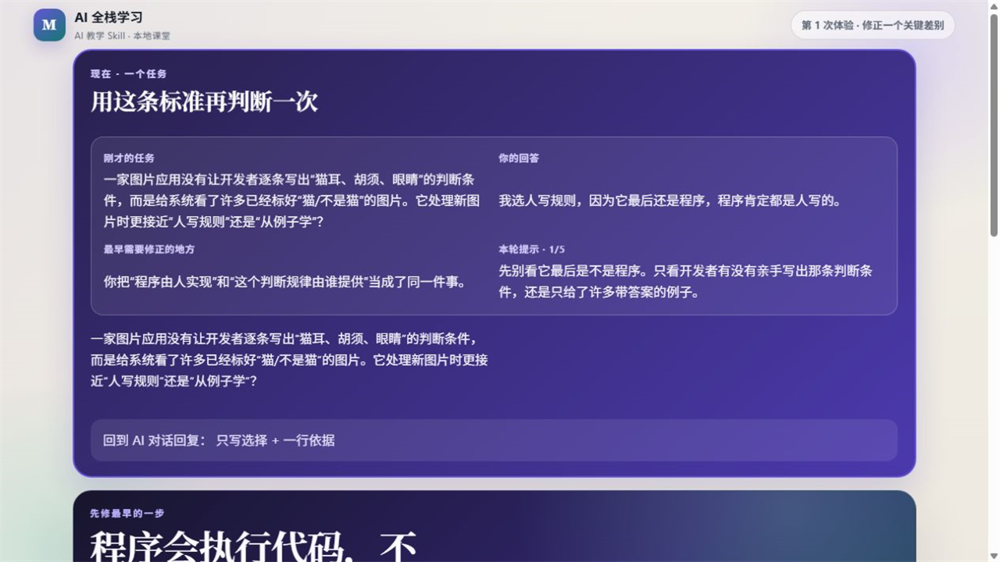
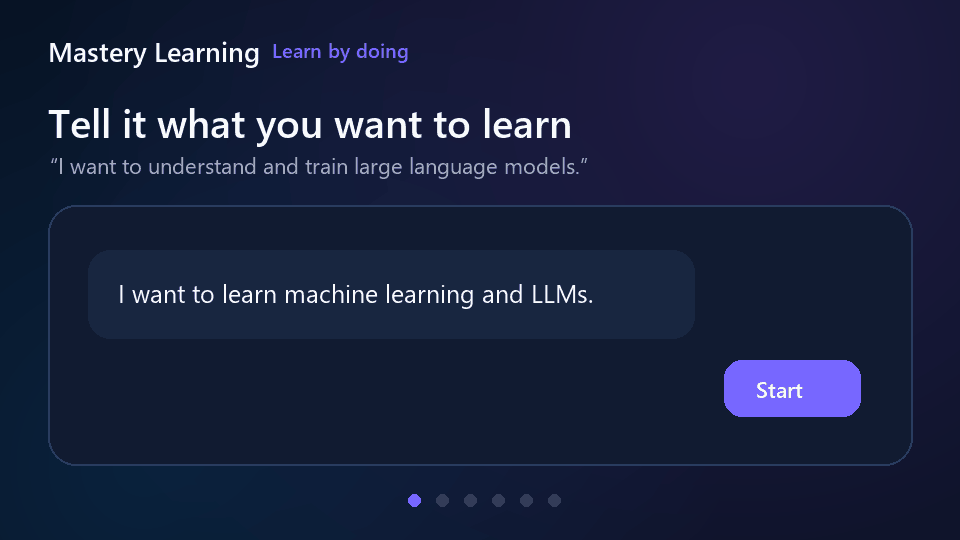

# Mastery Tutor

**A local-first mastery tutor for AI agents.**

Guided HTML lessons, hands-on practice, transfer checks, spaced review, and progress that stays in
your own workspace.

It ships as one product with two cooperating Skills: `mastery-coach` teaches and tracks learning;
`mastery-tool-creator` builds the interactive labs a lesson actually needs.

[Website](https://fanfanfanfanfan626.github.io/mastery-tutor/) · [简体中文](README.zh-CN.md) · [AI one-prompt install](AI_INSTALL.md) ·
[Manual install](INSTALL.md) · [Compatibility](COMPATIBILITY.md)

[](https://github.com/fanfanfanfanfan626/mastery-tutor/actions/workflows/verify.yml)
[](https://github.com/fanfanfanfanfan626/mastery-tutor/releases)

> **Release status:** `main` is the next release candidate. The latest published package still uses
> the legacy Mastery Learning identity; do not describe `main` as a released adapter until the E2
> evidence gate and tagged release workflow pass.
> Current evidence levels and promotion criteria are documented in [COMPATIBILITY.md](COMPATIBILITY.md).



*Real output from the deterministic classroom renderer: the retry keeps the original task, learner
response, earliest error, and a level-1 hint without revealing the answer. The
[source and byte-level capture provenance](docs/assets/classroom-feedback-real.provenance.json) are
checked into the repository.*

<details><summary>Illustrated end-to-end walkthrough</summary>



This second asset is an illustrated product flow, not a learner-session recording.
</details>

| Host | Status | Installation |
|---|---|---|
| Codex | **Engineering-verified · conversation evidence pending** | Complete plugin |
| Claude Code | Experimental | Two-Skill bundle |
| GitHub Copilot | Experimental | Two-Skill bundle |
| Generic Agent Skills hosts | Core-compatible | Two-Skill bundle |
| OpenCode | Planned | Not published yet |

“Engineering-verified” means the package and deterministic engines pass E0/E1 checks; it is not an
E2 claim about fresh AI conversations. “Core-compatible” means the two Skills can be discovered and
installed. See [COMPATIBILITY.md](COMPATIBILITY.md) for the evidence behind each label.

## Try it

Give your AI agent this prompt:

```text
Install Mastery Tutor from https://github.com/fanfanfanfanfan626/mastery-tutor.
Read AI_INSTALL.md first, detect the current host, install both required Skills,
and do not claim success until that host's verification steps pass. Report old installs before
changing them and preserve every .mastery learner workspace. If the host is Codex and
codex --version is unavailable, you may install or repair only the official Codex CLI by following
current OpenAI documentation. Do not copy a WindowsApps executable, change its permissions,
use skill-installer, or install one nested Skill.
```

For Codex, the result is one complete `mastery-tutor` plugin. For other compatible hosts, the
portable installer installs both `mastery-coach` and `mastery-tool-creator`; they are designed to be
used together. Manual instructions and success conditions are in [INSTALL.md](INSTALL.md).

Then start with an ordinary request:

```text
Help me learn machine learning and large language models from the beginning.
I can study for 40 minutes a day and prefer visual explanations.
```

Mastery Tutor first creates a compact, skippable onboarding classroom. It asks for background,
goals, pace, and teaching preferences in one place. The first lesson begins with something the
learner can see and try, then names the idea; it does not open with an entrance exam or glossary.

## What changes compared with a normal AI chat?

| A typical learning chat can… | Mastery Tutor instead… |
|---|---|
| open with definitions or a field taxonomy | starts with a concrete problem, prediction, reveal, and one guided use |
| confuse “that makes sense” with mastery | requires independent retrieval, application, and transfer evidence |
| scatter lessons across chat messages | maintains one polished local HTML classroom per learning thread |
| reveal an answer after the first mistake | gives staged hints and records how much help was needed |
| forget what happened next session | stores inspectable progress in the learner's `.mastery/` directory |
| declare success after a same-session exercise | schedules delayed review and can mark prior mastery as fragile |

The project is research-informed, not outcome-proven. Automated tests verify software and teaching
contracts; they do not prove that learners study faster or remember longer. The evidence boundary
is documented in [docs/pedagogy-evidence.md](docs/pedagogy-evidence.md) and
[docs/evaluation.md](docs/evaluation.md).

## Two Skills, one tutor

- **`mastery-coach`** plans the curriculum, teaches, adapts, evaluates evidence, schedules review,
  and restores learning state.
- **`mastery-tool-creator`** creates and verifies reusable lesson labs, code exercises, simulations,
  visual explanations, and accessible fallbacks.

On hosts that support subagents, substantial lessons may use bounded planning, subject review,
classroom design, and independent QA behind the scenes. The learner still interacts with one tutor,
and only one component may update learning state. Single-agent hosts use the same teaching contract.

The canonical sources live in [`skills/`](skills/). Host packages are generated adapters; changes
must never be hand-copied between platforms. The architecture and host requirements are described
in [docs/architecture.md](docs/architecture.md) and [docs/host-contract.md](docs/host-contract.md).

## Built-in curriculum scope

The teaching engine can work from learner-provided books, papers, repositories, and custom concept
maps. Today, however, the only bundled, source-audited curriculum pack is machine learning, AI, and
large language models. Programming or mathematics outside that pack uses an explicit custom map;
the project does not claim complete ready-made coverage of every subject.

## Local by design

Learning records, lesson pages, exercises, and evidence stay in a workspace chosen by the learner.
No account or hosted database is required. The global registry only helps an agent locate learning
workspaces; it does not contain the full learner record. Review [SECURITY.md](SECURITY.md) before
enabling local code execution or browser-based lesson tools.

## Build and contribute

```bash
python quality/build_adapters.py --check
python skills/mastery-coach/scripts/curriculum_audit.py
python -m unittest discover -s quality -p "test_*.py" -v
```

Start with [CONTRIBUTING.md](CONTRIBUTING.md), the [roadmap](ROADMAP.md), or open an
[issue](https://github.com/fanfanfanfanfan626/mastery-tutor/issues). Adapter failures have a
dedicated issue form so compatibility claims stay reproducible.

## License

[MIT](LICENSE)

## Related projects

- [Idea Council](https://github.com/fanfanfanfanfan626/challenge-and-refine-ideas) helps an agent clarify and stress-test ideas before implementation.
- [Persistent AI Studio](https://github.com/fanfanfanfanfan626/orchestrate-agent-organization) governs authorized multi-agent product work across tasks.
