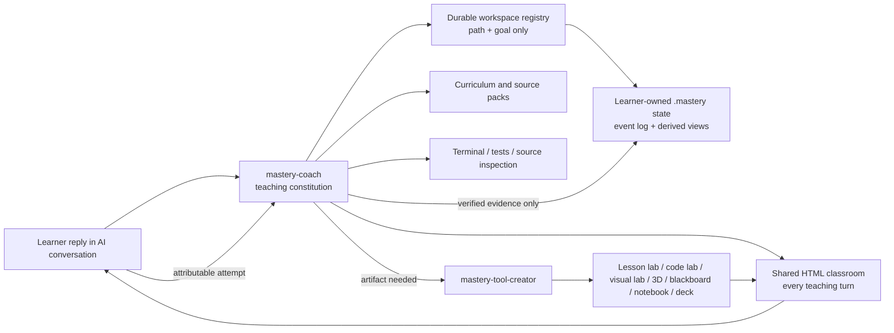

# Architecture

## Product boundary

The pedagogical core is an AI teaching Skill system; the currently packaged and tested adapter is a
Codex plugin. The AI conversation carries learner replies, while a local HTML classroom is the
required learner-facing teaching surface. Files, terminal checks, visualizations, notebooks, decks,
and executable labs remain subordinate instruments opened by the AI when the objective needs them.

## Why two Skills

`mastery-coach` owns all pedagogical decisions. `mastery-tool-creator` may be selected when the main Skill or learner requests an artifact, but has narrower authority: produce one instrument from a supplied outcome and rubric. This avoids a generated tool choosing the curriculum, awarding mastery, or replacing the conversation.

The Coach also owns a deterministic, no-script classroom renderer. This display layer is separate
from executable teaching tools: ordinary turns may update safely without invalidating a verified
lab, while JavaScript, code, simulations, notebooks, and other active artifacts remain behind the
Tool Creator's stronger scaffold, inspection, hash, and finalization gates.

## Classroom lifecycle

1. The Coach writes one bounded structured turn specification.
2. `render_classroom.py` validates and escapes it, then atomically updates the current local page and shared theme.
3. The AI starts the bundled allowlisted classroom server on an OS-assigned loopback port. Its root is `.mastery/classroom`, never `.mastery`; it exposes only `index.html` and the shared CSS with `no-store` headers, then opens or refreshes the page while keeping commands out of learner-facing content.
4. The page highlights exactly one action; the learner replies through the AI conversation.
5. The Coach updates the same page with feedback. It stores compact evidence and handoff state, not a raw HTML transcript.
6. The AI stops the recorded PID/session at close and verifies its assigned port is closed.

## Persistence

The learner state is local, transparent, and event-sourced. `evidence.jsonl` plus stable `concepts.json` definitions are the source of truth; `mastery.json` and `reviews.json` are derived views. A persistent OS byte lock under the registry lock directory serializes state operations and is released by the operating system on process death. Multi-file writes use a replayable journal and a revision commit point, so the next locked command completes an interrupted transaction before reading. Stable event IDs plus complete request fingerprints make retries converge; `rebuild` recovers derived views after corruption.

A compact per-workspace-entry registry under `MASTERY_HOME` or `CODEX_HOME` lets a new Codex task find learner workspaces without shared-file lost updates. It stores ID, path, goal, and update time—not evidence or conversation. Registry failure is explicit. Schema v1/v2/v3 migration creates an outside backup, downgrades uncertain legacy support so it cannot certify mastery, and validates the complete candidate before committing; exports/backups inside `.mastery/` are rejected.

The scheduler creates an initial one-day review and advances expanding intervals only after independent recall/review performed when due. Immediate explanation, exercises, assisted retrieval, and early reviews cannot inflate the interval. It intentionally does not claim individualized FSRS optimization without enough review history.

## Curriculum

Curriculum packs are prerequisite DAGs. `concepts.json` stores the complete pack snapshot and hash; learner scope does not delete definitions. Target profiles name final capability nodes, and a confirmed selection derives the required prerequisite closure plus a separate enrichment closure. Unselected concepts remain auditable without inflating the completion denominator. Each concept has an observable outcome, evidence dimensions, module, and source IDs. Each source records organization, authority, version/date, reuse boundary, concept coverage, known gaps, and check date. The complete map prevents omissions; the active path is validated against the confirmed scope and provisionally ordered from relevant background, self-positioning hypotheses, and later guided-learning observations.

The conversation layer owns adaptive pedagogy. A compact launch packet stores a revisable experience preset and optional tone, outside-task, and check boundaries. The Skill then selects one method and fallback for the current obstacle from a governed repertoire. Method choice affects interaction and practice, never concept definitions, evidence independence, review chronology, or mastery thresholds.

## Tool lifecycle

1. Main Skill determines that an artifact is needed.
2. Tool Creator scaffolds under `.mastery/tools/<id>/`.
3. Codex customizes the artifact without leaking learner answers.
4. `validate_tool.py` performs static structural checks without executing code.
5. Codex separately runs checks/renders in the available sandbox and `finalize_tool.py` archives a structured pass result bound to the exact tool-tree, manifest, and complete verification-report bytes; failed renders cannot finalize.
6. Before each reuse, static validation compares current bytes with the report; edited tools become `stale` until checked and finalized again. The learner uses only the current verified tool.
7. Main Skill evaluates the resulting performance and records evidence.

No tool may award mastery directly.

## Trust boundaries

- Learning content and imported repositories are untrusted inputs.
- Generated code runs only in the available sandbox or an explicitly authorized environment.
- Classroom and generated-tool servers bind to loopback and always request an OS-assigned port. Fixed ports are forbidden because multiple Windows processes can otherwise retain the same listener and silently switch the content served at one URL.
- The classroom server is allowlisted and cannot expose `.mastery` profile, plan, evidence, review, registry, or sibling-tool files. Executable labs run from their own verified directory on a separate assigned port.
- Generated HTML, manifest text, file paths, source URLs, and check commands are untrusted input. They are escaped, constrained to HTTPS where applicable, and rejected if they cross a regular-file workspace boundary through traversal, links, junctions, or reparse points.
- Authentication remains in official GitHub/Codex flows.
- Installed Skill changes require versioned review; session-level observations go to `improvement-proposals.md`.

## Evidence architecture

Package validation, engine tests, conversation behavior, usability, and learner outcomes are independent evidence levels. `quality/evals/plugin-evals.json` defines synthetic direct, indirect, follow-up, negative, and boundary conversations. `quality/eval_audit.py` binds run results to the suite hash, requires traceable criterion evidence, and rejects false passing labels. It intentionally does not infer educational effectiveness from program tests or self-scored mastery events. See [evaluation.md](evaluation.md) and [pedagogy-evidence.md](pedagogy-evidence.md).

Release archives canonicalize text to LF and store entries without compressor-dependent output. CI builds on Windows and Linux, audits each archive against the checked-out Git tree, and compares the resulting bytes. Tagged builds may add GitHub provenance attestations; a checksum alone is an integrity check, not publisher identity.

## State-engine modularity boundary

`mastery.py` remains a single-file executable in 0.4.2 so an extracted plugin can run without package installation. That portability choice does not authorize indefinite growth. A maintainability test freezes the entrypoint below 2,350 physical lines and rejects any top-level function longer than 150 lines. New state-engine behavior that would exceed either budget must first extract one cohesive sibling module while preserving the CLI contract.

The intended extraction order follows invariants rather than command names:

1. document and event schema validation;
2. registry discovery and OS locking;
3. review and mastery derivation;
4. migration adapters;
5. CLI parsing and presentation.

Transaction commit/recovery stays together until fault-injection tests prove an extracted boundary cannot expose mixed revisions. This avoids a cosmetic split that separates code while increasing semantic coupling.
